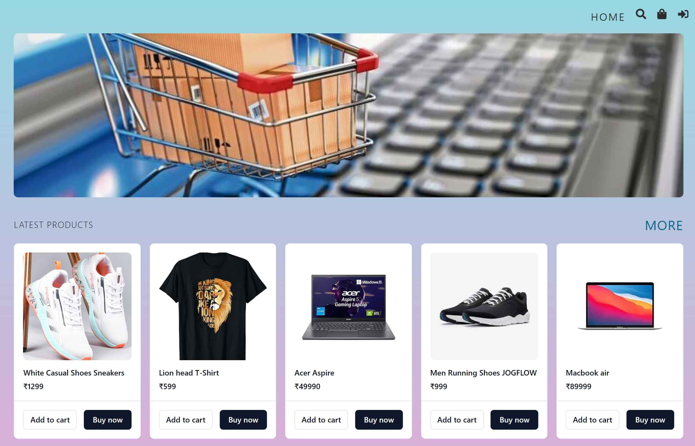

<div align="center">
  <br />
    <a href="https://github.com/as-ga/Ecommerce">
      
    </a>
  <br />

  <div>
    
    
    
    
    

  </div>

<h3 align="center">Full Stack Ecommerce WebApp</h3>

   <div align="center">
     Welcome to our cutting-edge E-commerce website built with React, MongoDB, Express, and Node.js! This robust and scalable application provides a seamless shopping experience for users while leveraging the power of modern web technologies.
    </div>
</div>

## 📋 <a name="table">Table of Contents</a>

1. ⚙️ [Tech Stack](#tech-stack)
2. 🔋 [Features](#features)
3. 🤸 [Quick Start](#quick-start)
4. 🔗 [Links](#links)

## <a name="tech-stack">⚙️ Tech Stack</a>

- React
- TypeScript
- MongoDB
- Express
- Npde.js
- Firbase
- Stripe
- Shadcn

## <a name="features">🔋 Features</a>

👉 **Authentication and Authorization**: Secure user access with registration, login, and route protection.

👉 **Responsive UI/UX**: A seamless experience across devices with a user-friendly interface

👉 **Shopping Cart**: Easily add and remove items, and proceed to checkout effortlessly.

👉 **Order Management**: Keep track of your orders and view order history.

👉 **Product Catalog**:  Browse a diverse range of products with detailed information and images.

👉 **Admin Dashboard**: Streamline your business operations with a comprehensive admin dashboard for managing products, orders, and users. 

and many more, including code architecture and reusability

## <a name="quick-start">🤸 Quick Start</a>

Follow these steps to set up the project locally on your machine.

**Prerequisites**

    Make sure you have the following installed on your machine:

- [Git](https://git-scm.com/)
- [Node.js](https://nodejs.org/en)
- [npm](https://www.npmjs.com/) (Node Package Manager)


**Installation**

```bash
git clone https://github.com/as-ga/ecommerce-frontend.git
cd ecommerce-frontend
npm install
npm run dev
```

**Environment Variables**
- Create a new file named `.env` in root folder:

```env
VITE_FIREBASE_KEY=
VITE_AUTH_DOMAIN=
VITE_PROJECT_ID=
VITE_STORAGE_BUCKET=
VITE_MESSAGING_SENDER_ID=
VITE_APP_ID=

VITE_SERVER=
VITE_STRIPE_KEY=
```


## <a name="links">🔗 Links</a>

Ashutsoh Gaurav [here](https://www.linkedin.com/in/ashutosh-li)